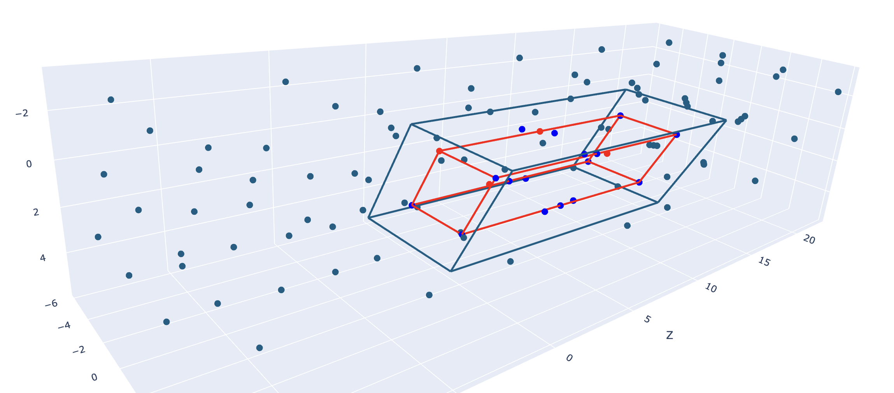

# fastsupercell

When representing a material to pass into a machine learning model, we need to represent it as a graph. each atom is a node, and nearby atoms are connected by an edge. During message passing, information is passed from the nodes to the edges.

For a material with periodic structure (like crystals), atoms on the left side of the unit cell are connected to atoms on the right side of the unit cell. (since the unit cell is periodic - just like in pacman!). One challenging part is to calculate: which atoms are neighbors in a periodic system.

The standard way to do this is to create a "supercell" by repeating the unit cell into a 3x3x3 tiling of it. Then run a knn algorithm from the center cell to each of the 26 neighboring cells.

My hypothesis is that this is slow and takes up a lot of memory because most atoms that are in the surrounding cells are nowhere near neighbors. To speedup this calculation, I hypothesized that pruning the atoms in the supercell that are far away from the center cell would be a good idea. This repo implements this idea.

1. create a 3x3x3 supercell
2. now filter out atoms that are far away from the center cell in the supercell. We basically construct a scaled up version of the unit cell and only keep the atoms that are within the scaled up unit cell. (we determine if atoms are in the scaled up supercell using cross products)
3. pass the atoms into a knn algorithm to get the edges. The algorithm will be faster since it runs in nlogn time. but since n is much smaller, it'll run faster.

The main benefit of this approach is that pruning for atoms inside the supercell can be done in parallel (on a GPU). whereas the knn algorithm is serial for each atom.

However, after some testing, I realized that this approach is slower (on cpu), and that it doesn't matter. since the knn algorithm doesn't take that much time to run. it's probably not that expensive during the training process.

 

  

In this image, the red atoms are the original atoms in the unit cell. The red parallelepiped is the unit cell.

The teal parallelepiped is the cutoff of supercell. All atoms outside the teal parallelepiped are pruned.
The bright blue atoms are those within the radius of the unit cell (They are inside the teal parallelepiped and can be connected to atoms in the unit cell).

The teal atoms are those that are pruned by the algorithm. They do not fall close enough to the unit cell and will never be within the radius of the unit cell to be connected to them.

### How do we determine the mask parallelepiped (teal parallelepiped)?

Here's the general algorithm:
- 1) calculate the normal vectors of the faces of the unit cell (6 vectors total - but 3 "unique" vectors since we can get the other 3 by inverting the first 3)
- 2) use the inverse lattice matrix to map these normal vectors to the unit cube
  - Since lattice matrices can be viewed as linear transformations from the R^3 standard basis to the lattice coordinates, multiplying these vector by the inverse matrix will map these normal vectors back to the standard basis.
  - The core idea is this: we do calculations in the standard basis since it's easier to calculate if a point is inside/outside the masking parallelepiped.
  - By mapping the "distance we need to prune" to the standard basis, we can easily check if a point is inside the masking parallelepiped just by seeing if it's x-coodinate is < norm1, y-coordinate is < norm2, and z-coordinate is < norm3.
- 3) Now take the norm of these normal vectors. This norm tells us how far away from the original unit cell should we keep the atoms.
- 4) make a supercell of the unit cell. so we have 27 copies of it
- 5) for each of the 27 copies, if an atom is within the norm of the corresponding normal vector(s), then we keep it.

### Improvements:
- only use the pruning algorithm for larger systems. don't prune it for smaller systems
- Do the pruning in c++. torch is prob too slow

### install
pip install --upgrade wheel setuptools
pip install git+https://github.com/u1234x1234/pynanoflann.git@0.0.8